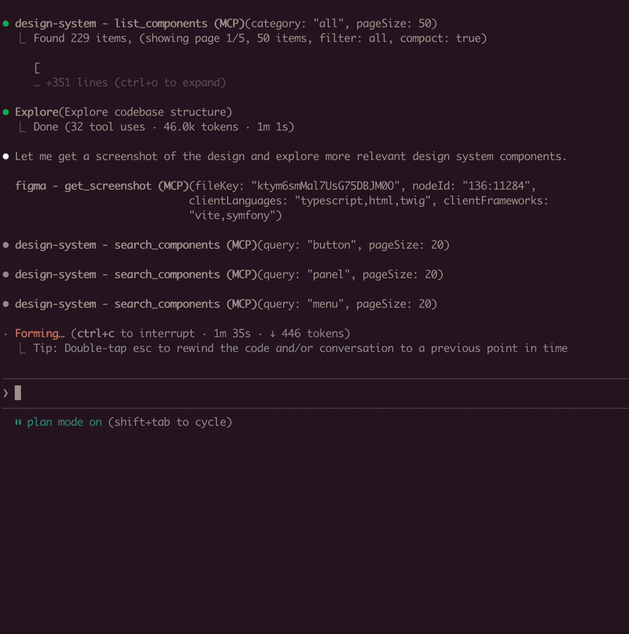
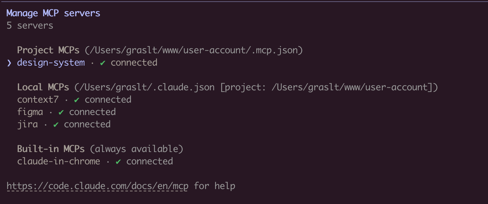

# MCP Design System Extractor

A Model Context Protocol (MCP) server that extracts component information from Storybook design systems. Connects to Storybook instances and extracts HTML, styles, and component metadata.



## Installation

### Using Claude CLI (Recommended)

```bash
claude mcp add design-system npx mcp-design-system-extractor@latest \
  --env STORYBOOK_URL=http://localhost:6006
```

With self-signed certificate:
```bash
claude mcp add design-system npx mcp-design-system-extractor@latest \
  --env STORYBOOK_URL=https://my-storybook.example.com \
  --env NODE_TLS_REJECT_UNAUTHORIZED=0
```

### Using npm

```bash
npm install -g mcp-design-system-extractor
```

Then configure in your MCP client (see [Environment Variables](#environment-variables)).

### From Source

```bash
git clone https://github.com/freema/mcp-design-system-extractor.git
cd mcp-design-system-extractor
npm install && npm run build
npm run setup  # Interactive setup for Claude Desktop
```

## Key Dependencies

- **Puppeteer**: Uses headless Chrome for dynamic JavaScript component rendering
- **Chrome/Chromium**: Required for Puppeteer (automatically handled in Docker)
- Works with built Storybook distributions

## Features

- **List Components**: Get all available components from your Storybook with compact mode
- **Extract HTML**: Get the rendered HTML of any component (async or sync mode)
- **Search Components**: Find components by name, title, category, or purpose
- **Component Dependencies**: Analyze which components are used within other components
- **Theme Information**: Extract design system theme (colors, spacing, typography)
- **External CSS Analysis**: Fetch and analyze CSS files to extract design tokens
- **Async Job Queue**: Long-running operations run in background with job tracking

## Environment Variables

| Variable | Description | Default |
|----------|-------------|---------|
| `STORYBOOK_URL` | URL of your Storybook instance | `http://localhost:6006` |
| `NODE_TLS_REJECT_UNAUTHORIZED` | Set to `0` to skip SSL certificate verification (for self-signed certs) | `1` |

**Example with self-signed certificate:**
```json
{
  "mcpServers": {
    "design-system": {
      "command": "node",
      "args": ["/path/to/dist/index.js"],
      "env": {
        "STORYBOOK_URL": "https://my-storybook.example.com",
        "NODE_TLS_REJECT_UNAUTHORIZED": "0"
      }
    }
  }
}
```

## Usage

See [DEVELOPMENT.md](./DEVELOPMENT.md) for detailed setup instructions.

## Available Tools (9 total)

### Core Tools

1. **list_components**
   - Lists all available components from the Storybook instance
   - Use `compact: true` for minimal output (reduces response size)
   - Filter by `category` parameter
   - Supports pagination with `page` and `pageSize` (default: 20)

2. **get_component_html**
   - Extracts HTML from a specific component story
   - **Async by default**: Returns `job_id`, use `job_status` to poll for results
   - Set `async: false` for synchronous mode (uses `timeout` parameter)
   - Use `variantsOnly: true` to get list of available variants (sync, fast)
   - Optional `includeStyles: true` for CSS extraction (Storybook CSS filtered out)
   - Story ID format: `"component-name--story-name"` or just `"component-name"` (auto-resolves to default variant)

3. **search_components**
   - Search components by name, title, category, or purpose
   - `query`: Search term (use `"*"` for all)
   - `purpose`: Find by function ("form inputs", "navigation", "feedback", "buttons", etc.)
   - `searchIn`: "name", "title", "category", or "all" (default)
   - Supports pagination with `page` and `pageSize`

### Component Analysis Tools

4. **get_component_dependencies**
   - Analyzes rendered HTML to find which other components are used internally
   - Detects React components, web components, and CSS class patterns
   - Requires story ID format: `"component-name--story-name"`

### Design System Tools

5. **get_theme_info**
   - Extracts design system theme (colors, spacing, typography, breakpoints)
   - Gets CSS custom properties/variables
   - Use `includeAll: true` for all CSS variables

6. **get_external_css**
   - **DEFAULT**: Returns only design tokens + file stats (avoids token limits)
   - Extracts & categorizes tokens: colors, spacing, typography, shadows
   - Use `includeFullCSS: true` only when you need full CSS content
   - Security-protected: only accepts URLs from same domain as Storybook

### Job Management Tools

7. **job_status**
   - Check status of an async job
   - Returns: `status`, `result` (when completed), `error` (when failed)
   - Poll this after calling `get_component_html` in async mode

8. **job_cancel**
   - Cancel a queued or running job
   - Returns whether cancellation was successful

9. **job_list**
   - List all jobs with their status
   - Filter by `status`: "all" (default), "active" (queued/running), "completed"
   - Returns job list + queue statistics

## Example Usage

```typescript
// List all components (compact mode recommended)
await list_components({ compact: true });

// Search for components
await search_components({ query: "button", searchIn: "name" });

// Find components by purpose
await search_components({ purpose: "form inputs" });

// Get variants for a component
await get_component_html({
  componentId: "button",
  variantsOnly: true
});
// Returns: { variants: ["primary", "secondary", "disabled"] }

// Get HTML (async mode - default)
await get_component_html({ componentId: "button--primary" });
// Returns: { job_id: "job_xxx", status: "queued" }

// Poll for result
await job_status({ job_id: "job_xxx" });
// Returns: { status: "completed", result: { html: "...", classes: [...] } }

// Get HTML (sync mode)
await get_component_html({
  componentId: "button--primary",
  async: false,
  timeout: 30000
});
// Returns: { html: "...", classes: [...] }

// Get HTML with styles
await get_component_html({
  componentId: "button--primary",
  async: false,
  includeStyles: true
});

// Check all running jobs
await job_list({ status: "active" });

// Extract theme info
await get_theme_info({ includeAll: false });

// Get design tokens from CSS
await get_external_css({
  cssUrl: "https://my-storybook.com/assets/main.css"
});
```

### AI Assistant Usage Tips

1. **Start with discovery**: Use `list_components` with `compact: true`
2. **Get variants first**: Use `get_component_html` with `variantsOnly: true`
3. **Use async for HTML**: Default async mode prevents timeouts on large components
4. **Poll job_status**: Check job completion before reading results
5. **Search by purpose**: Use `search_components` with `purpose` parameter

## Example Prompts

Once connected, you can use natural language prompts with Claude:



**Component Discovery:**
```
Show me all available button components in the design system
```

**Building New Features:**
```
I need to create a user profile card. Find relevant components
from the design system and show me their HTML structure.
```

**Design System Analysis:**
```
Extract the color palette and typography tokens from the design system.
I want to ensure my new component matches the existing styles.
```

**Component Migration:**
```
Get the HTML and styles for the "alert" component. I need to
recreate it in a different framework while keeping the same look.
```

**Multi-Tool Workflow:**
```
First list all form-related components, then get the HTML for
the input and select components. I'm building a registration form.
```

## How It Works

Connects to Storybook via `/index.json` and `/iframe.html` endpoints. Uses Puppeteer with headless Chrome for dynamic JavaScript rendering. Long-running operations use an in-memory job queue with max 2 concurrent jobs and 1-hour TTL for completed jobs.

## Troubleshooting

- Ensure Storybook is running and `STORYBOOK_URL` is correct
- Use `list_components` first to see available components
- For large components, use async mode (default) and poll `job_status`
- Check `/index.json` endpoint directly in browser
- **SSL certificate errors**: Set `NODE_TLS_REJECT_UNAUTHORIZED=0` for self-signed certificates
- See [DEVELOPMENT.md](./DEVELOPMENT.md) for detailed troubleshooting

## Requirements

- Node.js 18+
- Chrome/Chromium (for Puppeteer)
- Running Storybook instance

## Development

See [DEVELOPMENT.md](./DEVELOPMENT.md) for detailed development instructions.

## License

MIT

---

Created by [Tomas Grasl](https://www.tomasgrasl.cz/)
